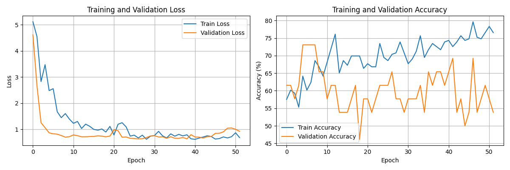
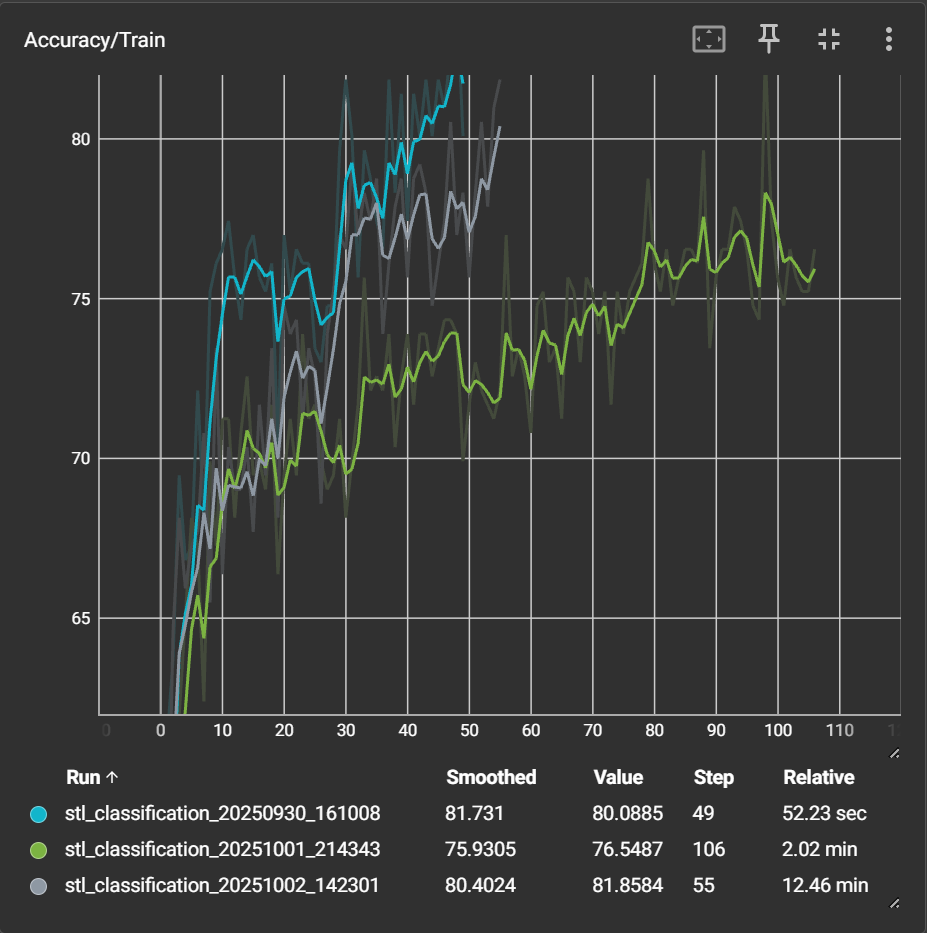
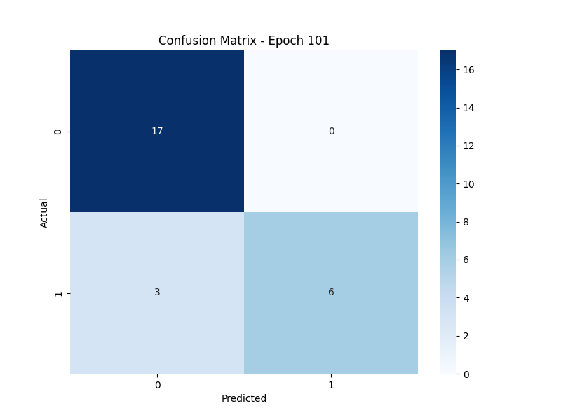
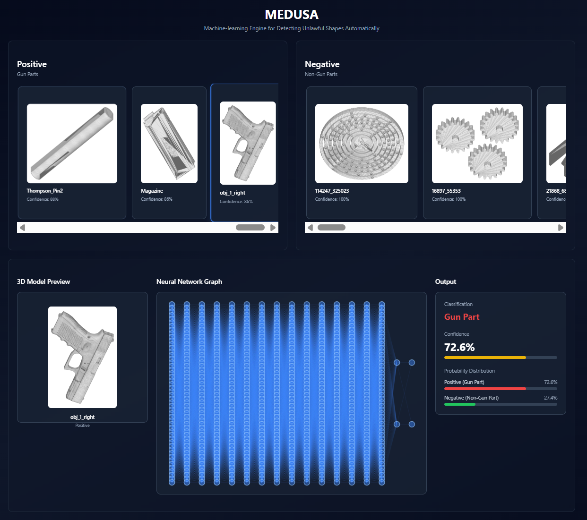

# MEDUSA

### Machine-learning Engine for Detecting Unlawful Shapes Automatically

### **TLDR: MEDUSA is a Graph Neural Network (GNN) classifier designed to look for ghost gun parts in 3D models.**

## Problem Statement

The Cal Poly Pomona Maker Studio offers free 3D printing for any active student or staff, which opens our 3D printers to the risk of malicious users attempting to 3D print firearm components. 24/7 monitoring of our 3D print farm by human staff is expensive, unreliable, and inefficient, creating a need for an automated monitoring solution.

## Existing solutions

Efforts to keep ghost gun parts off printers and file shares span policy, infrastructure, and model-level detection.

### Platform-side moderation of uploads:

File repositories (e.g. Thingiverse) now combine AI flagging with human review to block firearm models during upload and remove existing files. However, they are proprietary, policy-driven, and don't stop users from modeling components themselves or trading models behind closed doors. See coverage of Thingiverse’s AI-driven enforcement and recent takedowns: [Tom’s Hardware](https://www.tomshardware.com/3d-printing/3d-printing-companies-turn-to-ai-to-block-production-of-ghost-guns-we-spoke-with-thingiverse-about-its-new-ai-driven-ghost-gun-detection-strategy), [The Register](https://www.theregister.com/2025/07/23/thingiverse_drops_3d_gun_designs/), and [ABC News](https://abcnews.go.com/US/manhattan-da-sends-warning-ghost-gun-makers-wake/story?id=120220475). 

### Workflow/infrastructure blockers

Print&Go's “3D GUN'T” is a commercial tool that analyzes CAD files (and in some deployments, camera streams) to detect gun-like shapes and stop jobs before and during printing. 3DPrinterOS and Montclair State have announced a collaboration to identify gun components from their “design signatures” within a cloud print-management stack. The issue with these approaches is both the models and datasets are closed-source, and there aren't peer-reviewed metrics available. Sources: [Print&Go product post](https://printandgo.tech/blog/3d-gunt-solution-to-prevent-3d-printed-ghost-guns), [3Printr news](https://www.3printr.com/printgo-develops-software-to-detect-illegal-3d-printed-weapons-0174876/), [VoxelMatters](https://www.voxelmatters.com/3dprinteros-develops-algorithm-to-identify-3d-printed-gun-parts/), and [Fabbaloo](https://www.fabbaloo.com/news/3dprinteros-and-montclair-state-university-partner-to-detect-3d-printed-gun-parts). 

## Methods used for geometry detection

### Multi-view rendering (2D CNN/Vision-based Transformer)

* Render silhouettes/RGB/depth from several viewpoints and fuse features to classify objects
* Pros: Easy to implement, leverages proven 2D models and architectures
* Cons: Loses fine geometric detail; “dummy material” (i.e., model a box around the component to remove later) can cause the model to fail
* Refs: [MVCNN (ICCV 2015)](https://openaccess.thecvf.com/content_iccv_2015/papers/Su_Multi-View_Convolutional_Neural_ICCV_2015_paper.pdf), [MVCNN code](https://github.com/suhangpro/mvcnn) 

### Volumetric / Voxel Grids (3D CNN)

* Voxelize the mesh and run 3D convolutions
* Pros: Direct 3D receptive fields; simple to implement
* Cons: Memory scales cubically with resolution, causing models to be coarse at practical sizes
* Refs: [VoxNet (IROS 2015)](https://dimatura.net/publications/voxnet_maturana_scherer_iros15.pdf), [3D ShapeNets (CVPR 2015)](https://openaccess.thecvf.com/content_cvpr_2015/papers/Wu_3D_ShapeNets_A_2015_CVPR_paper.pdf)

### Point-cloud networks (PointNet family / DGCNN)

* Sample points (optionally with normals) from the surface and learn permutation-invariant features
* Pros: Good fidelity vs. cost; robust to messy meshes and re-meshing
* Cons: Sampling/normal-estimation choices affect stability; limited explicit topology use
* Refs: [PointNet (CVPR 2017)](https://arxiv.org/abs/1612.00593), [PointNet++ (NeurIPS 2017)](https://proceedings.neurips.cc/paper_files/paper/2017/file/d8bf84be3800d12f74d8b05e9b89836f-Paper.pdf), [DGCNN (arXiv)](https://arxiv.org/abs/1801.07829) 

## Requirements

MEDUSA **must** be able to:

* Differentiate between gun components and normal 3D models
* Run within a reasonable time and compute budget on consumer hardware
* Detect ghost gun parts even when obfuscated by “dummy material”
* Detect both ghost gun components and full assemblies
* Handle messy geometry via tolerant sampling
* Scale across a print farm

## Overview/Key Processes

1. **STL Sampling**: Sample converted 3D mesh structures generated from STL 3D models
2. **Feature Extraction**: Compute geometric features for each vertex (position, normals, curvature, etc.)
3. **Graph Neural Network**: Using Graph **Attention** and Graph Convolutional layers for model structure ([GAT](https://arxiv.org/abs/1710.10903), [GCN](https://arxiv.org/abs/1609.02907); PyG docs: [GATConv](https://pytorch-geometric.readthedocs.io/en/latest/generated/torch_geometric.nn.conv.GATConv.html), [GCNConv](https://pytorch-geometric.readthedocs.io/en/latest/generated/torch_geometric.nn.conv.GCNConv.html))
4. **Classification**: Binary classification with proper handling of imbalanced datasets (e.g., weighted loss in PyTorch [CrossEntropyLoss `weight` param](https://docs.pytorch.org/docs/stable/generated/torch.nn.CrossEntropyLoss.html)).

## Dataset

The dataset contains approximately 300 STL files:

* **Positive class**: ~100 ghost gun part STL files (barrels, frames, slides, triggers, etc.)

  * Dataset was obtained by browsing publicly available ghost-gun part assemblies
* **Negative class**: ~200 non-ghost-gun STL files (various mechanical parts)

  * [trimesh](https://trimesh.org/) was used to download 200 random STL files. 

## Notable files:

```
gnn_model.py   # The GNN itself
data_loader.py # Handles dataset loading, preprocessing, and batch creation for training.
train.py       # Train, evaluate, and save the GNN
```

## Model Architecture

* Graph Attention Network (GAT) or GCN layers ([papers](https://arxiv.org/abs/1710.10903), [https://arxiv.org/abs/1609.02907](https://arxiv.org/abs/1609.02907))
* Batch normalization and residual connections
* Multiple pooling strategies (mean, max, add, concat; e.g., PyG global pools: [mean](https://pytorch-geometric.readthedocs.io/en/latest/generated/torch_geometric.nn.pool.global_mean_pool.html)) 
* Deeper classification head with dropout

## Key Features

* **Automatic STL Processing**: Converts 3D meshes to graph representations
* **Geometric Features**: Extracts meaningful features from 3D geometry
* **Imbalanced Dataset Handling**: Uses class weights and proper evaluation metrics
* **Caching**: Caches processed graphs for faster subsequent runs
* **Early Stopping**: Prevents overfitting with patience-based stopping (e.g., PyTorch Lightning [EarlyStopping](https://lightning.ai/docs/pytorch/stable/common/early_stopping.html))
* **Model Checkpointing**: Saves best model based on validation loss

## Output

The training process generates:

* `outputs/*/results.json`: Training and test metrics
* `outputs/*/model.pth`: Saved model weights and configuration
* `outputs/*/training_history.png`: Training curves
* TensorBoard logs in `runs/` directory (see PyTorch tutorial: [TensorBoard with PyTorch](https://docs.pytorch.org/tutorials/recipes/recipes/tensorboard_with_pytorch.html))
* Run `tensorboard --logdir "runs"` to view model training runs

## Performance Considerations

* **Memory Usage**: Larger graphs (more vertices/edges) require more memory
* **Processing Time**: STL conversion is the most time-consuming step
* **Caching**: First run processes all STL files; subsequent runs use cache
* **Batch Size**: Adjust based on available GPU memory

## Model Performance

### Training

**Loss**: 0.02914
**Training Accuracy**: 81.858%
**Validation Accuracy**: 88.4512%

### Validation

**Model Accuracy**: 76.19%
**Precision**: 75.76%
**Recall**: 76.19%
**F1**: 75.79%





## Future Improvements

* Support for more 3D file formats (OBJ, PLY, etc.)
* Advanced geometric features (curvature, shape descriptors)
* Data augmentation techniques for 3D graphs
* Ensemble methods for improved accuracy
* Increase sampling size/**efficiency**

## Limitations

* Extremely sparse sampling was required due to limited compute
* Large, free ghost-gun component datasets are difficult to find and heavily restricted

# Demo

The `demo` dir contains the code for **a** live interactive demo of the model.

## Features:

* STL selection menu with live preview
* Dynamic model loading
* Model inference API
* Model activation visualization (In Progress)



## Improvements:

* Display real GNN weights after inference
* Display more accurate visual of GNN architecture
* Improve 3D model render visuals


# Made In Association With:


## BSD 3-Clause License

Redistribution and use in source and binary forms, with or without modification, are permitted provided that the following conditions are met:

1. Redistributions of source code must retain the above copyright notice, this list of conditions, and the following disclaimer.
2. Redistributions in binary form must reproduce the above copyright notice, this list of conditions, and the following disclaimer in the documentation and/or other materials provided with the distribution.
3. Neither the name of the author nor the names of its contributors may be used to endorse or promote products derived from this software without specific prior written permission.

**DISCLAIMER:**

THIS SOFTWARE IS PROVIDED BY THE COPYRIGHT HOLDERS AND CONTRIBUTORS "AS IS" AND ANY EXPRESS OR IMPLIED WARRANTIES, INCLUDING, BUT NOT LIMITED TO, THE IMPLIED WARRANTIES OF MERCHANTABILITY AND FITNESS FOR A PARTICULAR PURPOSE ARE DISCLAIMED. IN NO EVENT SHALL THE COPYRIGHT HOLDER OR CONTRIBUTORS BE LIABLE FOR ANY DIRECT, INDIRECT, INCIDENTAL, SPECIAL, EXEMPLARY, OR CONSEQUENTIAL DAMAGES (INCLUDING, BUT NOT LIMITED TO, PROCUREMENT OF SUBSTITUTE GOODS OR SERVICES; LOSS OF USE, DATA, OR PROFITS; OR BUSINESS INTERRUPTION) HOWEVER CAUSED AND ON ANY THEORY OF LIABILITY, WHETHER IN CONTRACT, STRICT LIABILITY, OR TORT (INCLUDING NEGLIGENCE OR OTHERWISE) ARISING IN ANY WAY OUT OF THE USE OF THIS SOFTWARE, EVEN IF ADVISED OF THE POSSIBILITY OF SUCH DAMAGE.